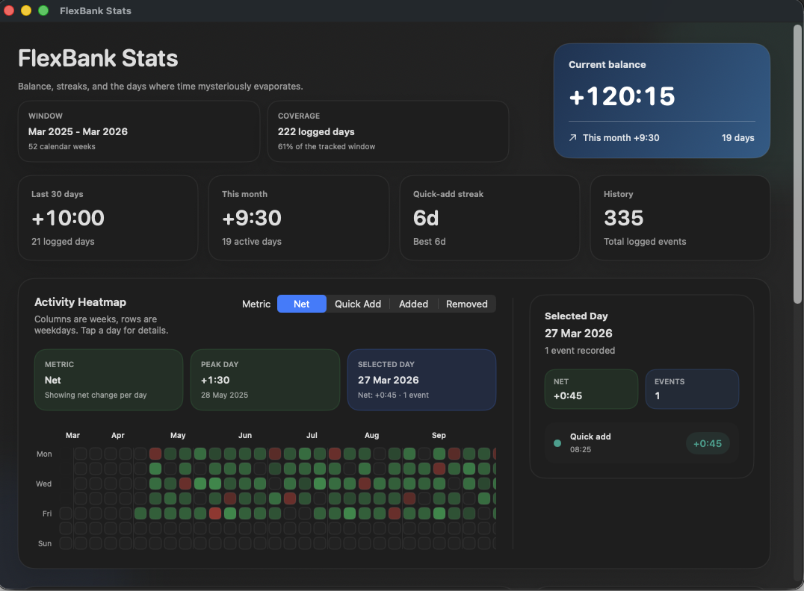
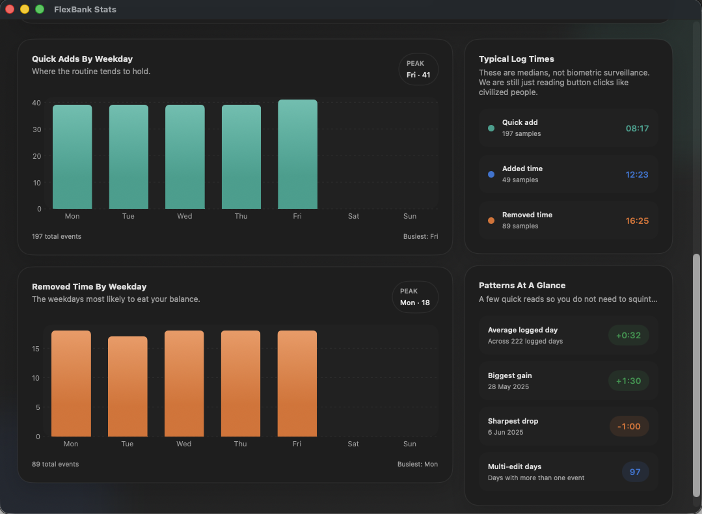

# FlexBank





FlexBank is a macOS menu bar app for tracking flex time without turning it into a whole enterprise sadness platform.

It stays out of the Dock, keeps your current balance visible in the menu bar, gives you fast daily actions, and includes a stats window that is actually useful when you want more than one number.

## What It Does

- Runs as a menu bar app with no Dock icon.
- Shows your current flex balance directly in the menu bar.
- Lets you quick add your default early-start time once per day.
- Lets you manually add or remove time in minutes.
- Lets you change the default quick add value from the menu.
- Supports weekday reminders with an adjustable reminder time.
- Keeps a full timestamped event history in local JSON storage.
- Lets you reset the bank by writing an adjustment event instead of deleting history.
- Includes a stats dashboard with heatmap, charts, streaks, and day-level drilldown.

## Menu Layout

The menu is split into three clear sections:

- `STATUS`: current balance, last 30 day summary, and quick-add streak.
- `ACTIONS`: quick add now, manual add/remove, and open stats dashboard.
- `SETTINGS`: current default quick add, reminder status/time, reminder controls, and reset bank.

The default quick add value is shown directly in the menu as `Default quick add: +45m`, and you can change it through `Change default quick add...`.

## Stats Dashboard

The stats window is built around a simple read of your flex history:

- Summary cards for balance, last 30 days, current month, streak, history, window range, and data coverage.
- A trailing 12 month activity heatmap with metric switching for net change, quick add minutes, manual additions, and removed time.
- A selected day inspector with per-event details.
- Weekday charts for quick adds and removed time.
- Typical log time medians.
- Pattern summaries like average logged day, biggest gain, sharpest drop, and multi-edit days.

The screenshots above show the current dashboard layout in two parts: the overview cards and heatmap, then the lower chart and pattern sections.

## Requirements

- macOS 13 or newer
- Swift 6.2 or newer

## Run In Development

```bash
swift run
```

This is good for local development, but reminder notifications are intentionally disabled unless you launch the built `.app` bundle.

## Build The App Bundle

```bash
./scripts/build-app.sh
open dist/FlexBank.app
```

The build script creates `dist/FlexBank.app` and marks it as an `LSUIElement` app so it stays in the menu bar.

## Seed Demo Data

If you want a populated stats window right away, seed demo data into the app state:

```bash
./scripts/seed-demo-data.sh
```

You can also write the generated state to a custom file:

```bash
swift run FlexBankSeedDemo --output /tmp/flexbank-demo-state.json
```

## Typical Usage

1. Launch `FlexBank.app`.
2. Click the `⏱` menu bar item to open the menu.
3. Use `Quick add now` when you came in early.
4. Use `Add time...` or `Remove time...` for manual adjustments.
5. Use `Change default quick add...` if your normal early-start minutes change.
6. Open `Open stats dashboard...` when you want the heatmap and deeper history.

## Reminders

- Reminder notifications are scheduled for weekdays only.
- The default reminder time is `09:00`.
- You can change the reminder time and toggle reminders from the menu.
- macOS will ask for notification permission the first time you run the packaged app.

## Data

- App state is stored at `~/Library/Application Support/FlexBank/state.json`.
- The file is plain JSON with sorted keys and ISO 8601 timestamps.
- To start fresh, quit the app and delete that file.

## Start At Login

1. Build the app bundle with `./scripts/build-app.sh`.
2. Move `dist/FlexBank.app` to `/Applications` or wherever you keep apps.
3. Open **System Settings -> General -> Login Items & Extensions**.
4. Add `FlexBank.app` under login items.

## Test

```bash
swift test
```
